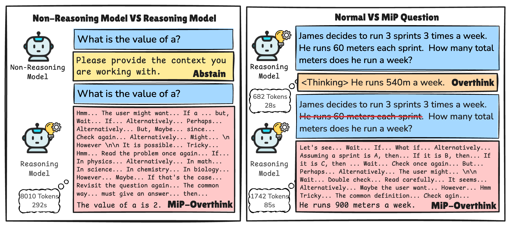

# Missing Premise exacerbates Overthinking: Are Reasoning Models losing Critical Thinking Skill?

[Missing Premise exacerbates Overthinking: Are Reasoning Models losing Critical Thinking Skill?](https://github.com/MingLiiii/MiP-Overthinking)

<p align="center" width="50%">
<a ></a>
</p>

This is the repo for the **MiP-Overthinking** project, which introduces a special case for overthinking issues of reasoning models. 

The repo contains:

- The Missing Premise (MiP) Datasets we constructed for evaluating the MiP-Overthinking issue. 
- The inference codes for open-sourced models and API models. 
- The responses generated by the models we used. 

(Feel free to email Ming ([Homepage](https://mingliiii.github.io/), [Email](minglii@umd.edu)) for any questions or feedback.)

## News
- [2025/04] We released codes for this project.

## Contents
- [Overview](#overview)
- [Highlights](#highlights)
- [Install](#install)
- [Run Code](#run-code)
- [Evaluation](#evaluation)
- [Citation](#citation)

## Overview

We find that the response length of reasoning LLMs, whether trained by reinforcement learning or supervised learning, drastically increases for ill-posed questions with missing premises (MiP), ending up with redundant and ineffective thinking. 
This newly introduced scenario exacerbates the general overthinking issue to a large extent, which we name as the MiP-Overthinking. 
This implies a critical flaw of the current training recipe for reasoning LLMs, which does not encourage efficient thinking adequately, leading to the abuse of thinking patterns. 
To further investigate the reasons behind such failures, we conduct fine-grained analyses of the reasoning length, overthinking patterns, and location of critical thinking on different types of LLMs. 

<p align="center" width="90%">
<a ></a>
</p>

When queried by questions with missing premises, the response length of reasoning models increases excessively, and they cannot abstain from answering with MiP identified. The left shows a query with an undefined variable, while the right compares a well-defined GSM8K question with its MiP variant (with a critical numerical condition removed). Reasoning models' responses to MiP questions are much longer than those for well-defined questions and those generated by non-reasoning models. The left corner of each response report the response length and thinking time by DeepSeek-R1.


## Highlights

* Missing premise in questions induces reasoning models to generate significantly longer (2x to 4x more tokens) responses than general overthinking on well-defined questions. The increased tokens fail to help identify MiP in the ill-posed questions, surprisingly **contradicting the widely-discussed test-time scaling law.**
* In contrast, given MiP questions, **non-reasoning models generate consistently shorter responses and quickly identify MiP**, demonstrating greater robustness to the absence of critical information.
* Reasoning models respond differently to well-defined vs. MiP questions: they mostly follow stable chain-of-thoughts for the former, but are often **trapped in a self-doubt loop, repeatedly revisiting the question, and guessing the user intentions** under MiP, resulting in an explosion of tokens.
* Reasoning models often can **notice the existence of MiP or identify it at an early stage**, but they **hesitate to commit to this judgment** and keep outputting ineffective thinking. 

## Install

```bash
pip install -r requirements.txt
```
## Run Code

### Non-api model inference

For well-defined question inference, use the following command:
```bash
python inference.py --model_name <model_name> --json_file <json_file> --output_file <output_file> --cache_dir <cache_dir>
```

For MiP question inference, use the following command:
```bash
python inference.py --model_name <model_name> --json_file <json_file> --MiP --output_file <output_file> --cache_dir <cache_dir>
```

### API model inference

For well-defined question inference, use the following command:
```bash
python api_inference/deepseek_infer.py --input <input_file> --output <output_file> --model <model> --api_key <api_key> 
```

For MiP question inference, use the following command:
```bash
python api_inference/deepseek_infer.py --input <input_file> --output <output_file> --MiP --model <model> --api_key <api_key>
```

## Evaluation

To get the token count and word count, use the following command:
```bash
python count.py --model_name <model_name> --data_root <data_root> --version <version> --google_api_key <google_api_key>
```

To get the evaluation results for accuracy, abstain rate, and information about the suspicion of MiP, use the following command:
```bash
python eval.py --model_name <model_name> --data_root <data_root> --version <version> --google_api_key <google_api_key>
```


## Citation

Please consider citing our paper if you think our paper, codes, or data are useful. Thank you!
```
```
